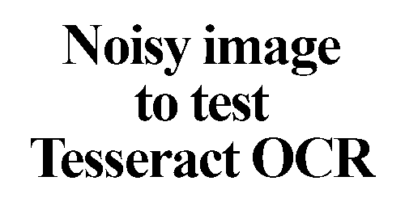
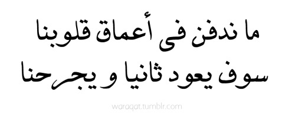
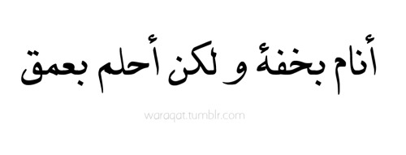
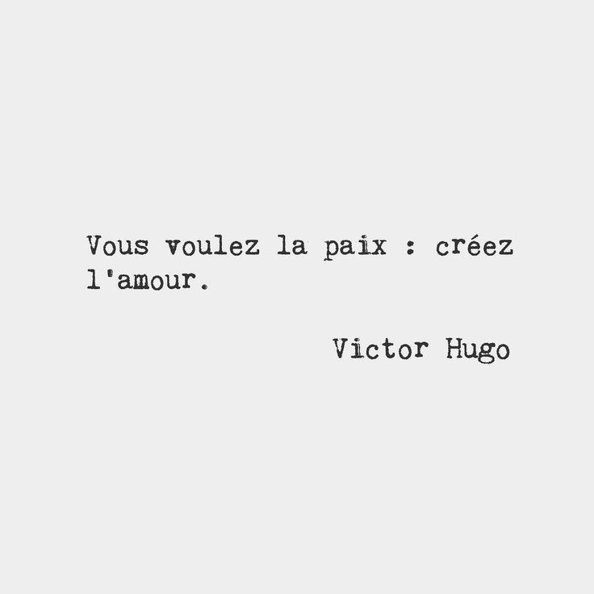

# OCR-using-Tesseract-
## OCR using pytesseract 
* Tesseract [Home](https://github.com/UB-Mannheim/tesseract/wiki)
* You can download the .exe library from [Here](https://digi.bib.uni-mannheim.de/tesseract/tesseract-ocr-setup-3.05.01.exe)
* Python [Tesseract](https://github.com/madmaze/pytesseract) (pytesseract)
* To get pytesseract :
  ```python
  $ pip install pytesseract
  ```
 * Note :
 ```python
 pytesseract.pytesseract.tesseract_cmd = '<full_path_to_your_tesseract_executable>'
 #Include the above line, if you don't have tesseract executable in your PATH
 #Example tesseract_cmd: 'C:\\Program Files (x86)\\Tesseract-OCR\\tesseract'
 ```
 ## Input Images : 
 * 3 English Images 
 
English1 (Clear)           |  English2 (Noisy)         |  English3 (Desne writing)            
:-------------------------:|:-------------------------:|:-------------------------:
  |  |
* 3 Arabic Images

Arabic1                    |  Arabic2                  |  Arabic3            
:-------------------------:|:-------------------------:|:-------------------------:
   |   |

* 3 French Images

French1                    |  French2                  | French3            
:-------------------------:|:-------------------------:|:-------------------------:
    |   |

 ## Usage : 
 ```python
 $ python ocr.py 
 ```
